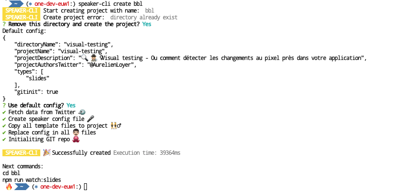
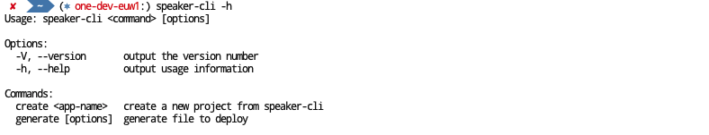
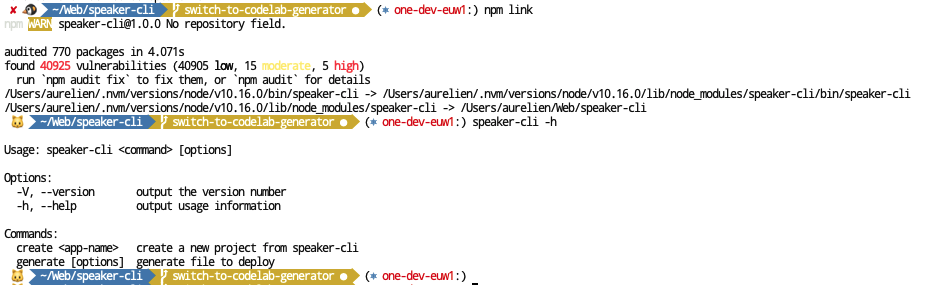

# SPEAKER-CLI

[](https://circleci.com/gh/DX-DeveloperExperience/speaker-cli)

## Description ✏️

Speaker CLI help people to generate slides / codelab and deploy it on gh-page / Netlify / Firebase / ... 📺

## Showcase

Some talks generated using speaker-cli
- 🐱 https://github.com/T3kstiil3/codelab-nestjs
- 🏗 https://github.com/T3kstiil3/bazel-bazel-bazel
- 🌏 https://github.com/EmmanuelDemey/codelab-litelement

## How to use 🧐

### Create a new projet

```sh
$ speaker-cli create your-project-name
```

#### Follow the cli and enjoy 😊. This should created:

- Homepage with links to your contents

  

- Slides using **Markdown** or **AsciiDoc** and **Revealjs**

  

- Codelab using **Markdown** or **AsciiDoc**

  

### Tips

Create with project using your previous config 👌



### Display help

```sh
$ speaker-cli -h
```




## Dev 👨🏻‍💻

Use `npm link` inside this folder to attach `speaker-cli` command and test it 🙂



